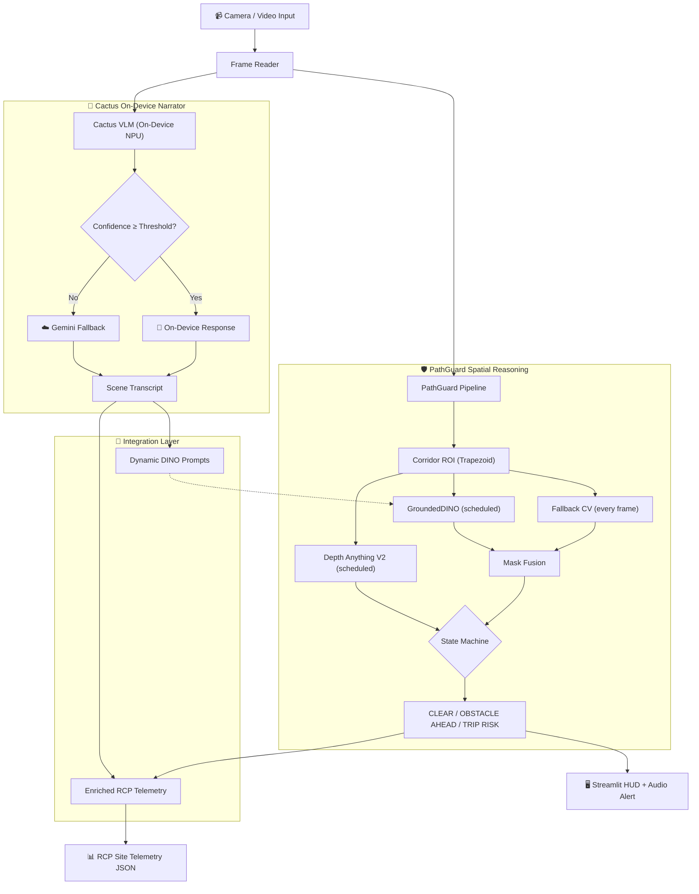
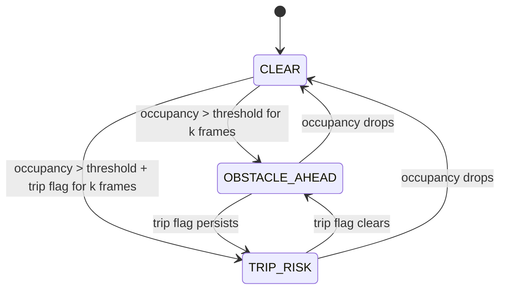

# 🛡️ PathGuard — On-Device Spatial Safety Intelligence

> **Real-time construction site hazard detection + on-device vision-language scene understanding, deployable on a Raspberry Pi 5, iPhone, or Android phone.**

PathGuard combines two integrated systems to protect construction workers:

1. **PathGuard HUD** — Always-on corridor-based spatial reasoning with GroundedDINO zero-shot detection, Depth Anything V2, and a persistence-based state machine (`CLEAR → OBSTACLE AHEAD → TRIP RISK`)
2. **Cactus Narrator** — On-device VLM (LFM2.5-VL-1.6B via Apple Neural Engine) with hybrid cloud routing, dynamic GroundedDINO prompt generation, and structured RCP construction telemetry

---

## 🔥 The Problem

In construction site bodycam streams, generic object detectors alone are insufficient:

- They miss site-specific clutter (cords, debris, temporary materials)
- They do not answer: *"Is there a hazard in my walking path right now?"*
- They require expensive GPU servers — impractical for field deployment
- Static prompt lists can't adapt to the current scene

## 💡 Our Solution

A **layered spatial safety system** where each layer adds intelligence but none are required:

| Layer | What It Does | Runs On | Always On? |
|-------|-------------|---------|------------|
| **Fallback CV** | Canny edges + morphology → corridor occupancy | Any CPU | ✅ Every frame |
| **GroundedDINO** | Zero-shot object detection with semantic labels | GPU / CPU | ⏱ Scheduled |
| **Depth Anything V2** | Relative depth → NEAR / MID / FAR urgency cues | GPU / CPU | ⏱ Scheduled |
| **Cactus VLM** | Scene understanding → dynamic DINO prompts | Apple NPU | ⏱ Sampled frames |
| **Gemini Cloud** | High-quality fallback when local model is uncertain | Cloud API | 🔄 On-demand |

**Key insight:** The system works even if every ML model fails — the classical CV fallback keeps the safety layer responsive.

---

## 🏗 Combined Architecture



### The Integration Loop (What Makes This One System)

1. **Cactus → PathGuard:** The narrator generates scene descriptions, then extracts a dynamic, dot-separated noun list via `generate_dino_prompt()`. This directly replaces PathGuard's hardcoded 60-word prompt list — the detector now searches for what's actually on the current site.

2. **PathGuard → Cactus RCP:** PathGuard's corridor occupancy scores, depth buckets, and trip risk flags feed into the RCP telemetry schema, making it spatially grounded rather than purely semantic.

---

## 📱 Edge Deployment Story

The Cactus VLM engine runs natively on ARM processors via optimized C++ with Apple Neural Engine acceleration. **No GPU server needed in the field.**

| Device | Decode (tok/s) | VLM TTFT | Use Case |
|--------|---------------|----------|----------|
| **Mac M4 Pro** | 173 | 0.1s (NPU) | Development & demo |
| **iPhone 17 Pro** | 136 | 0.1s (NPU) | Worker's phone as bodycam |
| **Galaxy S25 Ultra** | 91 | — | Android field device |
| **Raspberry Pi 5** | 24 | — | $80 hardhat-mounted edge node |
| **Pixel 6a** | 16-20 | — | Budget Android option |

*Benchmarks from Cactus Engine using LFM2-VL-450m (INT8). The classical CV fallback (PathGuard) runs at full speed on any CPU.*

> **Why this matters:** Most hackathon teams run everything on a beefy GPU server. Our system runs where workers actually are — their phone or a $80 Raspberry Pi clipped to their hardhat.

---

## 🛡️ PathGuard HUD — Spatial Safety

### Corridor-First Reasoning

Instead of detecting everywhere, we define a **trapezoidal corridor ROI** representing the expected walking lane. Every frame, we estimate obstacle occupancy inside that corridor via classical CV:

- Grayscale → Gaussian blur → Canny edges
- Morphological close + dilate → Connected components
- Occupancy ratio = `obstacle_area / corridor_area`

### State Machine for Stability

- **Slow to alarm:** Requires `persistence_frames` consecutive hazard frames before triggering
- **Fast to clear:** A single non-hazard frame instantly returns to CLEAR
- **Debounced events:** Suppresses duplicate event spam within 2-second windows

### Hazard State Machine



### Zero-Shot Labels + Relative Depth

- **GroundedDINO** runs every N frames (or when hazard rises) to add semantic labels
- **Depth Anything V2** provides qualitative NEAR/MID/FAR urgency cues
- Both are optional — the system works without them

---

## 🌵 Cactus Narrator — On-Device Scene Understanding

### True Hybrid Routing

1. Local VLM processes frame on Apple Neural Engine
2. If `confidence < threshold` → check cooldown timer
3. Off cooldown → Base64 encode → POST to Vertex AI `gemini-2.5-flash-lite`
4. On cooldown → return local result with warning

### Dual-Model Post-Processing

After video processing completes, two parallel threads extract structured data:

| Thread | Model | Output |
|--------|-------|--------|
| Thread 1 | `gemini-2.5-flash-lite` | Grounding DINO noun list (`crane . worker . tractor .`) |
| Thread 2 | `gemini-2.5-pro` | RCP Site Telemetry JSON (7-category schema) |

### RCP Telemetry Schema

The 7 observed categories extracted per timestamp:

1. `activity_observed` — what work is happening
2. `equipment_vehicles` — cranes, excavators, lifts
3. `materials_components` — rebar, blocks, concrete
4. `tools_methods` — trowel, drilling, mixing
5. `workforce_coordination` — headcount, roles
6. `safety_controls_ppe` — PPE presence/absence, barriers
7. `hazards_risks` — open excavation, suspended load, trip hazard

---

## 📂 Repository Structure

```
pathguard/
├── Home.py                              # Streamlit multipage entrypoint
├── pages/
│   ├── 1_🛡️_PathGuard_HUD.py            # Spatial safety HUD
│   └── 2_🌵_Cactus_Narrator.py          # On-device video narrator
├── pathguard/                           # Core spatial reasoning modules
│   ├── config.py                        # Defaults, prompts, corridor/runtime params
│   ├── realtime.py                      # Frame loop, scheduling, fusion, rendering
│   ├── corridor.py                      # Corridor geometry + overlap scoring
│   ├── fallback.py                      # Classical CV occupancy detector + blur gate
│   ├── events.py                        # Persistence/debounce state machine
│   ├── detect.py                        # GroundedDINO with dual-backend fallback
│   ├── depth.py                         # Depth Anything V2 + distance buckets
│   ├── segment.py                       # Optional SAM2 mask refinement
│   └── audio_alerts.py                  # Trip Risk audio alarm
├── narrator/                            # On-device VLM inference
│   └── cactus_vl.py                     # Cactus VLM + Vertex AI fallback + DINO/RCP
├── integration/                         # Bridges between systems
│   ├── dynamic_prompts.py               # Cactus DINO output → PathGuard prompt list
│   └── enriched_telemetry.py            # PathGuard spatial data → RCP enrichment
├── cactus/                              # Cactus C++ engine (compiled locally)
├── scripts/
│   └── download_models.sh              # Downloads + converts VLM weights to INT8
├── run_combined.sh                      # Launch both apps (multipage)
├── run_pathguard.sh                     # Launch PathGuard HUD only
├── run_narrator.sh                      # Launch Cactus Narrator only
├── setup.sh                             # One-shot bootstrap for Cactus engine
├── smoke_test.py                        # Import verification
├── requirements_pathguard.txt           # GPU/CUDA dependencies
├── requirements_narrator.txt            # macOS/Cactus dependencies
└── .env.example                         # API key template
```

---

## 🛠 Installation

### PathGuard HUD (GPU server or CUDA machine)

```bash
conda create -n pathguard python=3.11 -y
conda activate pathguard
pip3 install torch torchvision --index-url https://download.pytorch.org/whl/cu126
pip install -r requirements_pathguard.txt
```

### Cactus Narrator (macOS Apple Silicon)

```bash
chmod +x setup.sh && ./setup.sh
```

This automatically creates a venv, installs dependencies, compiles the Cactus C++ engine, and downloads + quantizes VLM weights.

### Configure API Key

```bash
cp .env.example .env
# Edit .env and add your GEMINI_API_KEY
```

> The API key is only used for the cloud fallback route. On-device inference works fully offline.

---

## 🚀 Running

```bash
# Both apps (multipage Streamlit)
./run_combined.sh

# PathGuard HUD only (GPU/CUDA)
./run_pathguard.sh

# Cactus Narrator only (macOS Apple Silicon)
./run_narrator.sh
```

The app opens at `http://localhost:8501`.

---

## 🔍 Findings

- A corridor-centric fallback detector is surprisingly strong for "in-path" alerts
- Zero-shot labels are useful for explainability, but not reliable enough alone
- Relative depth is valuable as a qualitative urgency cue, not absolute distance
- Hybrid on-device/cloud routing is practical for cost-conscious field deployment
- Dynamic prompt generation from scene understanding outperforms static prompt lists
- Robust demo behavior depends more on scheduling, gating, and state logic than on one model

## ⚠️ Known Limitations

- Relative distance is not metric distance in meters
- Static trapezoidal corridor — doesn't adapt to camera rotation or curved paths
- Cactus engine requires macOS Apple Silicon (PathGuard works on any platform)
- Cloud fallback depends on Gemini API availability and rate limits
- No temporal tracking — each frame is processed mostly independently
- GroundedDINO prompt list coverage depends on what Cactus observes

## 🔮 Future Extensions

- RTSP/live camera source (pipeline is capture-agnostic)
- Temporal object tracking for consistent labeling across frames
- Dynamic corridor adaptation using ego-motion estimation
- Depth-weighted hazard scoring (NEAR obstacles score higher)
- Full Raspberry Pi 5 end-to-end deployment with camera module
- Haptic/wearable alerting for field gear integration

---

## 📚 Model References

| Model | Purpose | Reference |
|-------|---------|-----------|
| GroundingDINO | Zero-shot object detection | [Paper](https://arxiv.org/abs/2303.05499) · [HF](https://huggingface.co/IDEA-Research/grounding-dino-tiny) |
| Depth Anything V2 | Relative monocular depth | [Repo](https://github.com/DepthAnything/Depth-Anything-V2) · [HF](https://huggingface.co/depth-anything/Depth-Anything-V2-Small-hf) |
| SAM2 | Optional segmentation refinement | [Repo](https://github.com/facebookresearch/sam2) |
| LFM2.5-VL-1.6B | On-device vision-language model | [LiquidAI](https://www.liquid.ai) |
| Cactus Engine | On-device inference runtime | [GitHub](https://github.com/cactus-compute/cactus) |
| Gemini 2.5 Flash/Pro | Cloud fallback + telemetry extraction | [Vertex AI](https://cloud.google.com/vertex-ai/docs/generative-ai/model-reference/gemini) |

---

## 📄 License

MIT

---

*UMD x Ironsite Startup Shell Hackathon 2026 — Pushing the Frontier of Spatial Intelligence*
