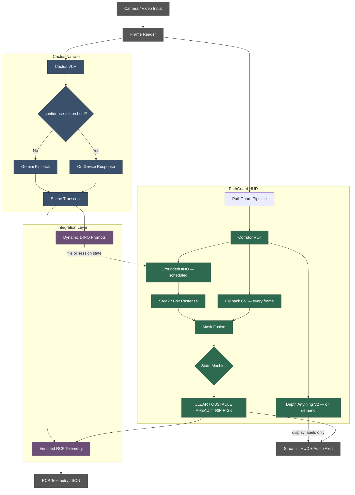
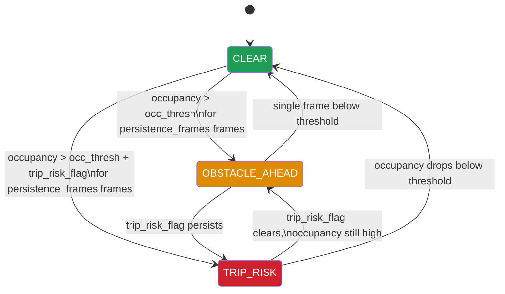
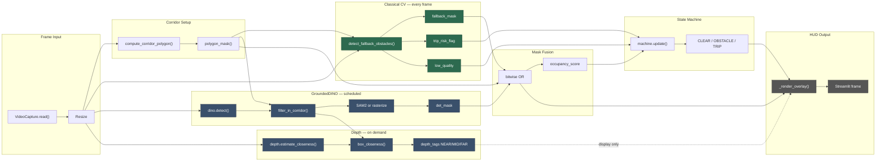

# PathGuard — On-Device Spatial Safety Intelligence

> **Construction workers trip on hoses, cables, and debris they never saw coming. PathGuard watches the walking path — raising an alarm before the fall happens. The classical CV safety floor runs on any CPU with no models loaded. GroundedDINO, Depth Anything V2, and an on-device VLM layer on top when available — every ML layer is optional.**

[](https://www.python.org/)
[](https://github.com/Rayhanpatel/PathGuard)
[](LICENSE.md)
[](https://youtu.be/Zr4QqsBu43g)
[](https://github.com/Rayhanpatel/PathGuard)

---

## Demo

[](https://youtu.be/Zr4QqsBu43g)

> Yellow corridor overlay · red obstacle mask · status chip cycling CLEAR → OBSTACLE AHEAD → TRIP RISK · audio alarm fires on TRIP RISK transitions.

---

## The Problem

Generic object detection on construction bodycam footage fails at one specific question: **"Is there a hazard in my walking path right now?"**

Detectors flag objects everywhere in the frame, not just in the walking path. Static prompt lists miss site-specific clutter that changes between sites and shifts. GPU-dependent pipelines cannot deploy to phones, Raspberry Pis, or hardhats. Single-model systems go dark when that model is slow, unavailable, or wrong.

PathGuard answers this differently: define the corridor first, then ask what's inside it — using as many or as few models as are available.

---

## Quick Start

```bash
git clone https://github.com/Rayhanpatel/PathGuard
cd PathGuard
python -m venv .venv && source .venv/bin/activate
pip install torch torchvision --index-url https://download.pytorch.org/whl/cu126
pip install -r requirements_pathguard.txt
./run_pathguard.sh
```

Drop any bodycam-style walkthrough video into the `video/` directory (created at runtime). The HUD works immediately — the classical CV fallback requires no models at all. Opens at `http://localhost:8501`.

For the full system including Cactus Narrator, see [Installation](#installation).

---

## What We Built

PathGuard is a two-part spatial safety system for construction workers. Both parts run as pages inside one Streamlit multipage app and communicate through shared files and session state.

**Part 1 — PathGuard HUD** is a real-time corridor-based obstacle detection pipeline. It defines a trapezoidal walking-lane ROI, runs classical CV every frame, and optionally schedules GroundedDINO (zero-shot detection), SAM2 (segmentation refinement), and Depth Anything V2 (relative distance). A persistence-based state machine governs transitions between `CLEAR`, `OBSTACLE AHEAD`, and `TRIP RISK`.

**Part 2 — Cactus Narrator** is an on-device VLM video narrator. It runs LFM2.5-VL-1.6B via the Cactus inference engine on Apple Neural Engine with Gemini cloud fallback, producing a scene transcript, dynamic GroundedDINO prompts, and RCP telemetry (a structured site-observation schema defined by the project).

**How they connect:** Cactus generates scene-specific detection prompts that replace PathGuard's static defaults. PathGuard's spatial event data (occupancy, depth, trip risk) feeds back into the RCP telemetry to spatially ground what would otherwise be purely semantic observations.

**Design philosophy:** Every layer degrades gracefully. The classical CV fallback runs on any CPU with no ML models loaded. GroundedDINO, Depth Anything V2, SAM2, the local VLM, and the Gemini cloud API are all optional escalations. The system is useful even when every ML model is unavailable.

---

## Platform Support

| Component | Current Implementation | Cactus Engine Capability |
|-----------|----------------------|--------------------------|
| PathGuard HUD | Any platform (macOS, Linux, Windows) | — |
| Cactus Narrator (Streamlit) | macOS Apple Silicon | — |
| Cactus engine + LFM2.5-VL-1.6B | — | macOS, iOS, Android, Flutter |

The Streamlit implementation of Cactus Narrator requires macOS Apple Silicon. The underlying Cactus v1.7 engine is cross-platform — a mobile port is a native SDK call away, validated by published benchmarks:

| Device | LFM2.5-VL-1.6B Latency | Decode Speed | RAM Usage |
|--------|------------------------|--------------|-----------|
| Mac M4 Pro | 0.2s | 76 tps | 87 MB |
| Mac M2 | 0.3s | 42 tps | 426 MB |
| iPhone 17 Pro | 0.3s | 33 tps | 156 MB |
| Galaxy S25 Ultra | 2.6s | 33 tps | 2 GB |

Source: [Cactus v1.7 Docs](https://www.cactuscompute.com/docs/v1.7) — INT8 quantized.

**Apple Silicon GPU note:** PathGuard HUD's ML models (GroundedDINO, Depth Anything V2) are initialized with `device="cuda"` in `realtime.py`. On macOS where CUDA is unavailable, both silently fall back to CPU — the code has no `torch.device("mps")` branch. Inference works but is slower than it would be with explicit MPS support. The Cactus Narrator runs on the Apple Neural Engine directly via the Cactus C++ engine and is unaffected.

---

## How It Evolved — Six Failures That Shaped the Design

We started with a single GroundedDINO detector running on every frame. It worked on clean, well-lit footage — and fell apart on real bodycam video. Shaky camera motion produced blurred frames that generated phantom detections. Objects outside the walking path triggered constant false alarms. Inference latency meant the safety layer went silent for hundreds of milliseconds between frames.

**First pivot: corridor-first reasoning.** Instead of detecting globally and filtering, we defined the walking lane first. This single decision eliminated the majority of irrelevant detections and let us ask a spatially specific question.

**Second pivot: classical CV as the backbone.** We wrote a Canny + morphology fallback that runs on every frame with zero ML overhead. This gave us an always-on safety floor that persists even when GroundedDINO is loading, crashing, or too slow.

**Third pivot: blur quality gate.** Motion blur was generating dense false edges inside the corridor. Adding a Laplacian variance check to suppress low-quality frames cut false TRIP RISK alarms substantially.

**Fourth pivot: persistence-based state machine.** Threshold-only hazard classification flickered between states on every frame. Requiring multiple consecutive hazard frames before alarming — but clearing instantly — gave stable, usable behavior.

**Fifth pivot: hybrid cloud routing.** Running the VLM locally was fast but occasionally uncertain. Rather than accepting low-confidence outputs, we added a confidence gate that routes to Gemini only when needed, with a cooldown timer to cap API costs. This mirrors what Cactus v1.7 later formalized as [Hybrid Cloud](https://www.cactuscompute.com/docs/v1.7) — we built the pattern independently before the native feature shipped.

**Sixth pivot: dynamic prompts.** The static prompt list we hand-tuned for general construction sites kept missing site-specific objects. Having the VLM observe the scene first and generate a tailored noun list for GroundedDINO closed the vocabulary gap.

Each layer was added because the previous configuration failed on a specific class of input. Nothing was designed in the abstract — every component exists because we watched the system fail without it.

---

## Technical Approach

### 1. Corridor-First Spatial Reasoning

Rather than detecting objects globally and filtering later, we define the region of interest first. A **trapezoidal corridor polygon** approximates the worker's walking lane using four fractional parameters (`bottom_width_frac`, `top_width_frac`, `height_frac`, `center_x_frac`). Every subsequent computation — fallback edges, detection filtering, occupancy scoring, depth estimation — operates relative to this corridor mask.

`corridor.py` also implements `split_corridor_bands()`, `band_overlap_scores()`, and `dominant_direction()` for LEFT/CENTER/RIGHT band analysis. These are built and tested but not currently wired into `realtime.py` — they exist as infrastructure for future directional alerting.

### 2. Classical CV as the Always-On Safety Net

On every frame, `fallback.py` runs a lightweight pipeline:

1. Grayscale conversion and Gaussian blur (5×5 kernel)
2. Laplacian variance as a **blur quality gate** — frames below `blur_thresh` (default 20.0) are marked `low_quality` and suppressed from triggering state transitions
3. Canny edge detection (thresholds: 60/160), masked to the corridor
4. Morphological close + dilate (5×5 kernel) to merge fragmented edges into connected components
5. Components below `min_component_area` (250px) are discarded entirely
6. **Trip risk heuristic:** for remaining components (≥ 250px), if aspect ratio ≥ 6.0 (elongated shapes like hoses, cables, rebar), set `trip_risk_flag`
7. **Occupancy score** = `obstacle_area / corridor_area`

This runs at full frame rate on any CPU. No models, no weights, no GPU.

### 3. Zero-Shot Detection via GroundedDINO

`detect.py` wraps GroundedDINO with a **dual-backend fallback strategy**: it first tries the `groundeddino_vl` PyPI package (not installed by default; install manually if available), and if that fails, falls back to Hugging Face's `AutoModelForZeroShotObjectDetection` using `IDEA-Research/grounding-dino-tiny`.

Detections are filtered to the corridor via `filter_detections_in_corridor()`. The function default for `min_overlap` is 0.15 (15% of the bounding box must overlap the corridor mask), but `realtime.py` passes `min_overlap=0.10` explicitly.

GroundedDINO is **on by default** (`use_dino=True`) and runs on a schedule (`dino_interval` frames, default 10) or opportunistically when fallback occupancy is rising or a trip risk flag is already set.

### 4. Monocular Depth for Relative Urgency

`depth.py` wraps Depth Anything V2 to produce a **closeness map** (not metric depth). The pipeline: min-max normalization → auto-polarity detection (compares median depth of top vs. bottom fifth of frame; inverts if the model's convention puts far objects higher) → bucketed into `NEAR` (≥ 0.66), `MID` (≥ 0.33), `FAR` (< 0.33).

`box_closeness()` returns the median closeness within a detection's bounding box. This provides qualitative urgency cues without implying metric accuracy.

Depth estimation is **off by default** (`use_depth=False` in `RuntimeParams`). Enable it from the Streamlit sidebar.

### 5. Persistence-Based State Machine

`events.py` implements `EventStateMachine`. The class constructor defaults to `persistence_frames=4`, but `realtime.py` passes `persistence_frames=2` from `RuntimeParams`. The runtime value (2) governs actual behavior:

- **Slow to alarm:** hazard counter must reach `persistence_frames` consecutive frames before transitioning from `CLEAR`
- **Fast to clear:** a single frame below threshold resets the counter immediately
- **Debounce:** duplicate state-transition events within `debounce_sec` (2.0s) are suppressed
- **Bounded memory:** event log capped at 200 entries

### 6. SAM2 Segmentation

`segment.py` attempts to `import sam2` at init. If the package is present and `predict_box_mask()` succeeds, it returns a pixel-level segmentation mask. Otherwise, `rasterize_box_mask()` draws a filled rectangle as the fallback. SAM2 is **off by default** (`use_sam2=False`). The `sam2` package is commented out in `requirements_pathguard.txt` — uncomment `# sam2>=1.0` and install SAM2 separately following the [SAM2 docs](https://github.com/facebookresearch/sam2) to enable it.

### 7. On-Device VLM with Hybrid Cloud Routing

`cactus_vl.py` implements confidence-gated hybrid routing:

1. Local LFM2.5-VL-1.6B (via Cactus C++ engine on Apple Neural Engine) processes the frame
2. If `confidence >= confidence_threshold` (default 0.90), local response is returned directly
3. If below threshold and `cooldown_seconds` (default 10.0) has elapsed, Base64-encodes the frame and POSTs to Vertex AI's `gemini-2.5-flash-lite` streaming endpoint
4. If on cooldown, returns local result with a warning annotation

The Python code reads only `GEMINI_API_KEY` from the environment. If you use the native Cactus Hybrid Cloud routing (`cactus auth`), the C++ engine also reads `CACTUS_CLOUD_API_KEY` — see [Cactus Hybrid AI docs](https://www.cactuscompute.com/docs/v1.7).

### 8. Dynamic Prompt Generation and RCP Telemetry

After processing a video, two Gemini calls run in parallel threads:

- **`generate_dino_prompt`** via `gemini-2.5-flash-lite`: extracts a dot-separated noun list from the full transcript
- **`generate_rcp_telemetry`** via `gemini-2.5-pro`: extracts structured JSON following a 7-category RCP schema (activity, equipment, materials, tools, workforce, safety/PPE, hazards). Output is hardened with `json_repair` to recover from malformed LLM JSON

### 9. Mask Fusion and HUD Rendering

Each frame's final obstacle mask is the bitwise OR of the fallback CV mask and the GroundedDINO detection mask (intersected with the corridor). The HUD renders: corridor polygon (yellow), obstacle mask (semi-transparent red), detection boxes with labels and depth tags, and status chip (green/orange/red).

---

## Architecture Diagram



**Legend:** 🟢 Green = PathGuard spatial reasoning · 🔵 Blue = Cactus Narrator inference · 🟣 Purple = Integration bridges · ⚫ Gray = I/O. Dashed arrows = file-based or async coupling (not live streams). Note: Depth feeds display labels (NEAR/MID/FAR) to the HUD overlay only — it does not influence state machine transitions.

---

## State Machine



Deliberately asymmetric: **slow to alarm** (requires `persistence_frames` consecutive hazard frames), **fast to clear** (single clean frame resets). This trades a few hundred milliseconds of latency for dramatically fewer false alarms in noisy bodycam footage.

---

## Data Flow — Per-Frame Pipeline



> **Reading this diagram:** Solid arrows are data dependencies. The dashed arrow from `depth_tags` to `_render_overlay()` indicates depth is display-only — it does not affect state transitions. The State Machine receives only `occupancy_score`, `trip_risk_flag`, and `low_quality`.

---

## System Pipeline

### PathGuard HUD (per frame)

1. Read frame from video file via OpenCV `VideoCapture`
2. Resize to `output_width` (default 960) preserving aspect ratio
3. Compute corridor polygon and binary mask from `CorridorParams`
4. Run fallback CV: blur gate → Canny edges → morphology → connected components → occupancy score + trip risk flag
5. If GroundedDINO is enabled and scheduled (or occupancy is rising): run zero-shot detection, filter to corridor at `min_overlap=0.10`
6. If Depth Anything V2 is enabled and scheduled (or detections exist): estimate closeness map, tag NEAR/MID/FAR
7. If SAM2 is enabled and the `sam2` package is installed: refine boxes into pixel masks; otherwise rasterize boxes as filled rectangles
8. Fuse fallback mask with detection mask (bitwise OR, intersected with corridor)
9. Compute final occupancy score, update state machine
10. Render HUD overlay, yield frame + metrics to Streamlit
11. If `simulate_realtime` is on, sleep to match source video FPS
12. On video completion: look for matching Cactus RCP file in `transcripts/`, merge spatial data via `enrich_rcp_with_spatial_data`, offer download

### Cactus Narrator (per sampled frame)

1. Accept input: live webcam (via `streamlit-webrtc`) or uploaded video file
2. Sample frames at configurable interval (set in Streamlit UI)
3. Resize and center-crop to 256×256 square for NPU fixed-shape constraint
4. Run local VLM inference via Cactus C++ engine (Apple Neural Engine)
5. Evaluate confidence; route to Gemini if below threshold and off cooldown
6. Append result to transcript (JSON-RPC format: timestamp, text, source, confidence)
7. Save transcript continuously to `transcripts/`
8. On completion: run parallel `generate_dino_prompt` + `generate_rcp_telemetry` via Gemini
9. Save DINO prompt file and RCP JSON; sync prompt text to `st.session_state` for cross-page access

---

## Key Defaults

| Parameter | Where | Default | Rationale |
|-----------|-------|---------|-----------|
| `bottom_width_frac` | `CorridorParams` | 0.90 | Corridor spans most of frame bottom (walking surface) |
| `top_width_frac` | `CorridorParams` | 0.34 | Perspective narrowing at far end |
| `height_frac` | `CorridorParams` | 0.64 | Lower two-thirds; upper third is sky/walls |
| `occ_thresh` | `RuntimeParams` | 0.015 | 1.5% corridor occupancy triggers attention |
| `persistence_frames` | `RuntimeParams` → `EventStateMachine` | 2 (config) / 4 (class default) | Consecutive hazard frames before alarm; config passes 2 |
| `blur_thresh` | `RuntimeParams` | 20.0 | Laplacian variance below 20 = low quality, suppresses alarm |
| `min_component_area` | `FallbackParams` | 250px | Minimum edge component to enter obstacle mask and trip check |
| `trip_aspect_ratio` | `FallbackParams` | 6.0 | Components ≥ 250px with aspect ratio ≥ 6 trigger trip flag |
| `canny_low / high` | `FallbackParams` | 60 / 160 | Edge detection thresholds |
| `use_dino` | `RuntimeParams` | `True` | GroundedDINO on by default |
| `use_depth` | `RuntimeParams` | `False` | Depth off by default; enable in sidebar |
| `use_sam2` | `RuntimeParams` | `False` | SAM2 off by default; requires manual install |
| `dino_interval` | `RuntimeParams` | 10 | Run GroundedDINO every 10th frame |
| `depth_interval` | `RuntimeParams` | 10 | Run depth estimation every 10th frame |
| `min_overlap` | `detect.py` / `realtime.py` | 0.15 (function) / 0.10 (runtime) | Fraction of bounding box that must intersect corridor |
| `confidence_threshold` | `cactus_vl.py` | 0.90 | Local VLM confidence gate for Gemini fallback |
| `cooldown_seconds` | `cactus_vl.py` | 10.0 | Min gap between Gemini API calls |
| `max_prompts` | `dynamic_prompts.py` | 256 | Cap on merged prompt list (tokenizer overflow prevention) |
| `debounce_sec` | `EventStateMachine` | 2.0 | Suppress duplicate state-transition events |
| `output_width` | `RuntimeParams` | 960 | Frame resize width for processing |

---

## How the Two Parts Connect

The integration is **real but manually sequenced**. They do not run simultaneously on the same video.

**Cactus → PathGuard (dynamic prompts):** Cactus saves a `*_dino_prompt.txt` to `transcripts/` and syncs to `st.session_state`. PathGuard HUD scans `transcripts/` on load; the user selects a prompt source from a sidebar dropdown. `dynamic_prompts.py` parses the dot-separated noun list and merges it with static defaults (dynamic prompts first, capped at 256 total).

**PathGuard → Cactus (enriched telemetry):** PathGuard looks for a matching `*_rcp.json` in `transcripts/` (keyed by video filename stem). If found, `enriched_telemetry.py` injects a `pathguard_spatial` section: total hazard events, trip risk count, obstacle count, peak occupancy, and a timestamped event log. It cross-references observation timestamps within a 5-second window, upgrading risk levels where they overlap.

**Manual steps required:** Run Cactus Narrator first, then switch to PathGuard HUD and select the generated prompt file. No live streaming bridge exists between the two pages.

---

## Findings

- **Corridor-centric fallback is surprisingly effective.** Restricting attention to the walking lane eliminates most irrelevant detections. The classical CV pipeline alone catches the majority of in-path obstacles.
- **The blur quality gate matters more than expected.** Without it, camera shake generates dense phantom edges that spike occupancy and cause false TRIP RISK alarms.
- **Zero-shot labels are valuable for explainability, not primary detection.** GroundedDINO adds human-readable labels and catches objects the edge detector misses, but latency makes it unsuitable as the sole detection layer.
- **Relative depth is a qualitative cue, not a measurement.** NEAR/MID/FAR buckets convey urgency without implying metric accuracy monocular depth cannot deliver.
- **Dynamic prompts outperform static prompts.** Scene-specific nouns from Cactus consistently surface objects the static default list misses.
- **Hybrid routing is practical.** The local VLM handles most frames; Gemini fills in only when confidence drops. The cooldown timer keeps API costs predictable.
- **The state machine's asymmetry is the key to demo quality.** Slow-to-alarm, fast-to-clear eliminates flickering that makes threshold-only systems unusable.
- **`json_repair` is essential.** Gemini occasionally produces trailing commas, unescaped quotes, or truncated output. Hardening the parser prevents silent failures in the RCP pipeline.

---

## Known Issues

- **~~`setup.sh` has two broken references.~~** *(Fixed — requirements and run command references corrected.)*
- **Do not use `cactus download` from Homebrew.** The pre-compiled zip files on HuggingFace are missing the `projector_layer_norm` tensor, causing a silent crash during model initialization. Use `scripts/download_models.sh` instead — it forces local reconversion from raw float32 checkpoints. This is documented in the script header.
- **SAM2 is not installed by default.** The package is commented out in `requirements_pathguard.txt`. The box rasterization fallback is always active in a standard install.
- **No MPS support.** On macOS Apple Silicon, GroundedDINO and Depth Anything V2 fall back to CPU because `realtime.py` hardcodes `device="cuda"` and neither `depth.py` nor `detect.py` has a `torch.device("mps")` branch.
- **`trip_component_area` (180px) has no independent effect.** The `min_component_area` gate (250px) on `fallback.py` line 47 skips all components below 250 before the trip check is reached. The trip risk heuristic effectively applies to components ≥ 250px with aspect ratio ≥ 6.0. The 180px parameter is vestigial.
- **`max_prompts` docstring is stale.** `dynamic_prompts.py` docstring says "default 50" but the actual code default is 256.

## Known Design Limitations

- **Relative distance is not metric distance.** NEAR/MID/FAR are qualitative.
- **Static corridor geometry.** The trapezoid does not adapt to camera rotation, tilting, or curved paths.
- **No temporal tracking.** Each frame is processed independently. The same object has no persistent ID across frames.
- **Cloud fallback depends on Gemini API availability.** Rate limits or outages degrade Narrator quality. The local model continues to run.
- **GroundedDINO vocabulary is bounded by Cactus observations.** If the Narrator misses an object, it won't appear in the dynamic prompt list.
- **`split_corridor_bands()`, `band_overlap_scores()`, and `dominant_direction()` in `corridor.py` are not wired into the pipeline.** They work correctly but are not called from `realtime.py`. Built as infrastructure for directional alerting.

---

## Project Report

For detailed technical documentation and evaluation results, see the [PathGuard Report](PathGuard_Report.pdf).

---

## Repository Layout

```
PathGuard/
│
├── Home.py                          Streamlit multipage entrypoint
│
├── pages/
│   ├── 1_🛡️_PathGuard_HUD.py        PathGuard spatial safety HUD page
│   └── 2_🌵_Cactus_Narrator.py      Cactus on-device video narrator page
│
├── pathguard/                       Core spatial reasoning package
│   ├── config.py                    CorridorParams, RuntimeParams, 60+ static PROMPTS, video discovery
│   ├── realtime.py                  Main frame loop: scheduling, fusion, overlay, generator
│   ├── corridor.py                  Corridor polygon, mask, intersection score, band analysis
│   ├── fallback.py                  Classical CV: Canny + morphology + trip heuristic (every frame)
│   ├── events.py                    Persistence/debounce state machine (CLEAR → OBSTACLE → TRIP)
│   ├── detect.py                    GroundedDINO — dual backend (groundeddino_vl + HF fallback)
│   ├── depth.py                     Depth Anything V2 — closeness map, NEAR/MID/FAR
│   ├── segment.py                   SAM2 wrapper with box rasterization fallback
│   └── audio_alerts.py              Trip Risk audio alarm (winsound / terminal bell)
│
├── narrator/
│   └── cactus_vl.py                 Cactus engine wrapper, Gemini hybrid routing, DINO/RCP generation
│
├── integration/
│   ├── dynamic_prompts.py           Parses Cactus DINO prompt files, merges with static list
│   └── enriched_telemetry.py        Injects PathGuard spatial events into RCP telemetry JSON
│
├── scripts/
│   └── download_models.sh           Downloads + reconverts LFM2.5-VL weights to INT8 locally
│
├── PathGuard_Report.pdf             Technical report with architecture diagrams and evaluation
├── demo_script.md                   3-minute hackathon demo script
├── smoke_test.py                    Import verification — narrator is optional, won't fail without Cactus
├── run_combined.sh                  Launches full multipage Streamlit app
├── run_pathguard.sh                 Launches PathGuard HUD standalone
├── run_narrator.sh                  Launches Cactus Narrator standalone
├── setup.sh                         Bootstrap script (installs deps + launches app)
├── requirements_pathguard.txt       PathGuard HUD dependencies
├── requirements_narrator.txt        Cactus Narrator dependencies
├── .env.example                     API key template (GEMINI_API_KEY)
└── .streamlit/config.toml           maxUploadSize = 1000 MB
```

The `cactus/` directory (C++ engine + Python bindings) is a git submodule — clone and compile it via the [Cactus repo](https://github.com/cactus-compute/cactus). The `weights/`, `transcripts/`, and `video/` directories are gitignored and created at runtime.

---

## Installation

### PathGuard HUD — any platform with Python 3.11+

```bash
python -m venv .venv
source .venv/bin/activate      # Linux/macOS
# .venv\Scripts\activate       # Windows

pip install torch torchvision --index-url https://download.pytorch.org/whl/cu126
pip install -r requirements_pathguard.txt
```

GroundedDINO and Depth Anything V2 download weights from Hugging Face on first run. On macOS where CUDA is unavailable, both fall back to CPU (no MPS branch).

### Cactus Narrator — macOS Apple Silicon

> `setup.sh` automates `pip install` and launches the app. You can also follow the manual steps below for more control.

```bash
# 1. Clone and build the Cactus C++ engine
#    See: https://github.com/cactus-compute/cactus

# 2. Install Python dependencies
pip install -r requirements_narrator.txt
pip install -r requirements_pathguard.txt

# 3. Download and quantize model weights
#    IMPORTANT: Do NOT use `cactus download` from Homebrew — the HuggingFace
#    zips are missing projector_layer_norm and will silently crash.
#    Use the local reconversion script instead:
bash scripts/download_models.sh LiquidAI/LFM2.5-VL-1.6B
```

### API Keys

Copy `.env.example` to `.env` and add your key:

```bash
cp .env.example .env
```

```
GEMINI_API_KEY="your_google_vertex_ai_key_here"
```

`GEMINI_API_KEY` is the only key the Python code reads. It powers the cloud VLM fallback, DINO prompt generation, and RCP telemetry extraction. PathGuard HUD's spatial pipeline does not require it.

If you use the native Cactus Hybrid Cloud routing (via `cactus auth`), the C++ engine also reads `CACTUS_CLOUD_API_KEY` from the environment — add it to your `.env` as needed. See the [Cactus Hybrid AI docs](https://www.cactuscompute.com/docs/v1.7) for details.

### Verify Installation

```bash
python smoke_test.py
```

Checks all package imports. The `narrator` import is flagged as a warning (not an error) if the Cactus engine is not available — expected on non-Apple-Silicon platforms.

---

## Run

```bash
./run_combined.sh       # Full multipage app (HUD + Narrator)
./run_pathguard.sh      # PathGuard HUD only
./run_narrator.sh       # Cactus Narrator only
```

On Windows:

```bash
set PYTHONPATH=.;cactus/python/src
streamlit run Home.py
```

Opens at `http://localhost:8501`.

---

## Model References

| Model | Purpose | Reference |
|-------|---------|-----------|
| **Grounding DINO** | Zero-shot object detection | [Paper](https://arxiv.org/abs/2303.05499) · [HF: grounding-dino-tiny](https://huggingface.co/IDEA-Research/grounding-dino-tiny) |
| **Depth Anything V2** | Relative monocular depth estimation | [Repo](https://github.com/DepthAnything/Depth-Anything-V2) · [HF: V2-Small-hf](https://huggingface.co/depth-anything/Depth-Anything-V2-Small-hf) |
| **SAM2** | Optional segmentation refinement | [Repo](https://github.com/facebookresearch/sam2) |
| **LFM2.5-VL-1.6B** | On-device vision-language model | [LiquidAI](https://www.liquid.ai) |
| **Cactus Engine v1.7** | On-device inference runtime (Apple Neural Engine) | [Docs](https://www.cactuscompute.com/docs/v1.7) · [GitHub](https://github.com/cactus-compute/cactus) |
| **Gemini 2.5 Flash Lite** | Cloud VLM fallback + DINO prompt extraction | [Vertex AI](https://cloud.google.com/vertex-ai/docs/generative-ai/model-reference/gemini) |
| **Gemini 2.5 Pro** | RCP telemetry extraction (complex structured JSON) | [Vertex AI](https://cloud.google.com/vertex-ai/docs/generative-ai/model-reference/gemini) |

---

## Future Extensions

- **Mobile port** *(Easy)* — Cactus engine already runs on iOS and Android per v1.7 benchmarks. A native Swift or Kotlin UI is the only remaining step.
- **RTSP / live camera source** *(Easy)* — `cv2.VideoCapture` already accepts RTSP URLs. No architectural change needed.
- **MPS device support** *(Easy)* — Add `torch.device("mps")` branch in `depth.py` and `detect.py` for Apple Silicon GPU acceleration.
- **Wire `dominant_direction()` into the pipeline** *(Easy)* — `corridor.py` already implements LEFT/CENTER/RIGHT band analysis. Connecting it to the state machine enables directional alerting.
- ~~**Fix `setup.sh`** *(Easy)*~~ — ✅ Done. Requirements and run command references corrected.
- **Fix trip risk gate** *(Easy)* — Move the `trip_component_area` check before the `min_component_area` continue, so that thin elongated components between 180–250px can independently trigger trip warnings.
- **Haptic/wearable alerting** *(Easy)* — Replace audio beep with vibration patterns for noisy job sites.
- **Enable SAM2** *(Medium)* — Uncomment in requirements and follow SAM2 install docs. The wrapper is already written.
- **Depth-weighted hazard scoring** *(Medium)* — NEAR obstacles should contribute more to the occupancy score than FAR ones.
- **Temporal object tracking** *(Medium)* — Persistent IDs across frames would reduce detection flicker and enable trajectory-based prediction.
- **Raspberry Pi 5 deployment** *(Medium)* — The classical CV pipeline and a lightweight VLM could run on a Pi 5 with a hardhat camera module.
- **Dynamic corridor adaptation** *(Research)* — Ego-motion estimation or SLAM to reshape the corridor in real time.

---

## Tested On

Developed and tested on **MacBook Pro M4 Pro, 24 GB RAM** (macOS Sequoia). PathGuard HUD has been verified on Linux and Windows. Cactus Narrator requires macOS Apple Silicon in its current Streamlit implementation. On Apple Silicon, GroundedDINO and Depth Anything V2 run on CPU (no MPS branch); the Cactus VLM runs on the Apple Neural Engine directly.

---

## Built By

| | |
|---|---|
| [**Rayhan Patel**](https://github.com/Rayhanpatel) | Cactus Narrator (`cactus_vl.py`), integration layer (`dynamic_prompts.py`, `enriched_telemetry.py`), system architecture |
| [**Suraj Rao**](https://github.com/surajrao2003) | PathGuard HUD: corridor geometry, classical CV fallback, GroundedDINO, SAM2 segmentation, state machine, realtime pipeline |
| [**Keshav Naram**](https://www.linkedin.com/in/keshav-naram-33a834285/) | Depth estimation pipeline (`depth.py`: Depth Anything V2 integration, closeness mapping, NEAR/MID/FAR buckets) |

Built for the **UMD × Ironsite Startup Shell Hackathon 2026**.

---

## License

This software is proprietary. See [LICENSE.md](LICENSE.md) for terms. For licensing inquiries, contact [rayhanbasheerpatel@gmail.com](mailto:rayhanbasheerpatel@gmail.com).

---

## Closing

PathGuard exists because construction sites are dangerous in a specific, preventable way: workers look ahead, not at their feet. The system was built to be useful at every hardware tier — from a phone in a chest pocket to a laptop at a site trailer. Every layer is optional. The system gets better as you add them, but it never goes dark when you remove them.
