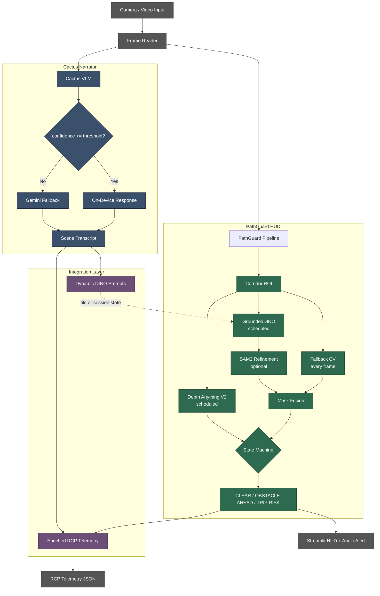
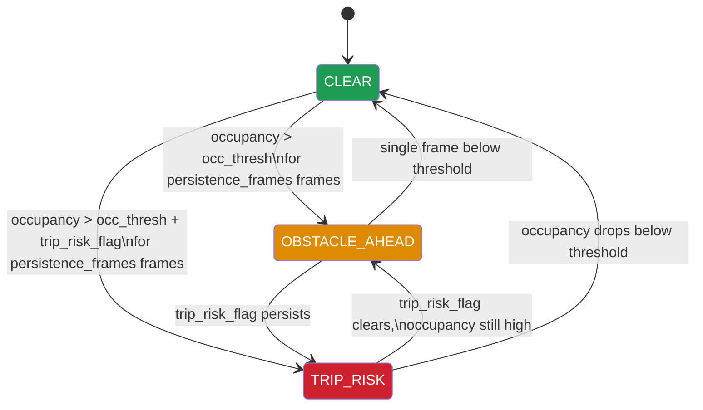

# PathGuard -- On-Device Spatial Safety Intelligence

> **Real-time construction site hazard detection + on-device vision-language scene understanding, deployable on a Raspberry Pi 5, iPhone, or Android phone.**

---

## What We Built

PathGuard is a two-part spatial safety system for construction workers. Both parts run as pages inside one Streamlit multipage app and communicate through shared files and session state.

**Part 1 -- PathGuard HUD** is a real-time corridor-based obstacle detection pipeline. It defines a trapezoidal walking-lane ROI, runs classical CV every frame, and optionally schedules GroundedDINO (zero-shot detection), SAM2 (segmentation refinement), and Depth Anything V2 (relative distance). A persistence-based state machine governs transitions between `CLEAR`, `OBSTACLE AHEAD`, and `TRIP RISK`.

**Part 2 -- Cactus Narrator** is an on-device VLM video narrator. It runs LFM2.5-VL-1.6B on the Apple Neural Engine with Gemini cloud fallback, producing a scene transcript, dynamic GroundedDINO prompts, and structured RCP site telemetry.

**How they relate:** Cactus generates scene-specific detection prompts that replace PathGuard's static defaults. PathGuard's spatial event data (occupancy, depth, trip risk) feeds back into the RCP telemetry to spatially ground what would otherwise be purely semantic observations.

**Design philosophy:** Every layer degrades gracefully. The classical CV fallback runs on any CPU with no ML models loaded. GroundedDINO, Depth Anything V2, SAM2, the local VLM, and the Gemini cloud API are all optional escalations. The system is useful even when every ML model is unavailable.

---

## Problem Framing

Generic object detection on construction bodycam footage is insufficient for one specific question: **"Is there a hazard in my walking path right now?"**

- Detectors flag objects everywhere in the frame, not just in the walking path.
- Static prompt lists miss site-specific clutter that changes between sites and shifts.
- GPU-dependent pipelines cannot deploy to phones, Raspberry Pis, or hardhats.
- Single-model systems go dark when that model is slow, unavailable, or wrong.

Our approach layers multiple techniques so that each one adds intelligence without being required. The cheapest layer runs every frame. Heavier models run on schedule. The VLM contributes asynchronously via the filesystem.

---

## Project Report

For detailed technical documentation, architecture diagrams, and evaluation results, see the [PathGuard Report](PathGuard_Report.pdf). 

---

## Process -- How We Got Here

We started with a single GroundedDINO detector running on every frame. It worked on clean, well-lit footage -- and fell apart on real bodycam video. Shaky camera motion produced blurred frames that generated phantom detections. Objects outside the walking path triggered constant false alarms. Inference latency meant the safety layer went silent for hundreds of milliseconds between frames.

**First pivot: corridor-first reasoning.** Instead of detecting globally and filtering, we defined the walking lane first. This single decision eliminated the majority of irrelevant detections and let us ask a spatially specific question.

**Second pivot: classical CV as the backbone.** We wrote a Canny + morphology fallback that runs on every frame with zero ML overhead. This gave us an always-on safety floor that persists even when GroundedDINO is loading, crashing, or too slow.

**Third pivot: blur quality gate.** Motion blur was generating dense false edges inside the corridor. Adding a Laplacian variance check to suppress low-quality frames cut false TRIP RISK alarms substantially.

**Fourth pivot: persistence-based state machine.** Threshold-only hazard classification flickered between states on every frame. Requiring multiple consecutive hazard frames before alarming -- but clearing instantly -- gave stable, usable behavior.

**Fifth pivot: hybrid cloud routing.** Running the VLM locally on Apple Neural Engine was fast but occasionally uncertain. Rather than accepting low-confidence outputs, we added a confidence gate that routes to Gemini only when needed, with a cooldown timer to cap API costs.

**Sixth pivot: dynamic prompts.** The static prompt list we hand-tuned for general construction sites kept missing site-specific objects. Having the VLM observe the scene first and generate a tailored noun list for GroundedDINO closed the vocabulary gap.

Each layer was added because the previous configuration failed on a specific class of input. Nothing was designed in the abstract -- every component exists because we watched the system fail without it.

---

## Our Approach (From First Principles)

### 1. Corridor-First Spatial Reasoning

Rather than detecting objects globally and filtering later, we define the region of interest first. A **trapezoidal corridor polygon** approximates the worker's walking lane using four fractional parameters (`bottom_width_frac`, `top_width_frac`, `height_frac`, `center_x_frac`). Every subsequent computation -- fallback edges, detection filtering, occupancy scoring, depth estimation -- operates relative to this corridor mask.

This inverts the typical pipeline: instead of "detect everything, then decide what matters," we ask "what's in the path?" first.

### 2. Classical CV as the Always-On Safety Net

On every frame, `fallback.py` runs a lightweight pipeline:

1. Grayscale conversion and Gaussian blur
2. Laplacian variance as a **blur quality gate** -- if the frame is too blurry (camera motion, low light), we suppress false positives by marking it `low_quality`
3. Canny edge detection, masked to the corridor
4. Morphological close + dilate to merge fragmented edges into connected components
5. Each component above `min_component_area` pixels contributes to the obstacle mask
6. **Trip risk heuristic:** components with area >= `trip_component_area` and aspect ratio >= 6.0 (elongated shapes like hoses, cables, rebar) set a `trip_risk_flag`
7. **Occupancy score** = `obstacle_area / corridor_area`

This runs at full frame rate on any CPU. No models, no weights, no GPU.

### 3. Zero-Shot Detection via GroundedDINO

`detect.py` wraps GroundedDINO with a **dual-backend fallback strategy**: it first tries the `groundeddino_vl` PyPI package (which requires separate config/checkpoint files), and if that fails, falls back to Hugging Face's `AutoModelForZeroShotObjectDetection` using `IDEA-Research/grounding-dino-tiny`. Both backends are loaded once and reused.

Detections are filtered to the corridor by checking what fraction of each bounding box overlaps the corridor mask (`min_overlap=0.10`). Only in-corridor detections contribute to the obstacle mask.

GroundedDINO runs on a schedule (`dino_interval` frames) or opportunistically when the fallback detector's occupancy score approaches the threshold or a trip risk flag is already set. This prevents wasting GPU cycles on clear frames while catching rising hazards early.

### 4. Monocular Depth for Relative Urgency

`depth.py` wraps Depth Anything V2 to produce a **closeness map** (not a metric depth map). The raw depth output undergoes:

- Min-max normalization
- **Auto-polarity detection:** compares median depth of the top vs. bottom fifth of the frame. In forward-walking video, the bottom is typically closer; if the model's convention is inverted, we flip it.
- Bucketed into `NEAR` (>= 0.66), `MID` (>= 0.33), `FAR` (< 0.33)

For each detected object, `box_closeness` computes the median closeness within the bounding box. This provides qualitative urgency cues ("the obstacle is NEAR") without claiming metric accuracy.

### 5. Persistence-Based State Machine

`events.py` implements a state machine that resists both false positives and false negatives:

- **Slow to alarm:** The occupancy score must exceed `occ_thresh` for `persistence_frames` consecutive frames before transitioning from `CLEAR` to `OBSTACLE AHEAD` (or `TRIP RISK` if the trip flag is also set).
- **Fast to clear:** A single frame below threshold resets the counter and returns to `CLEAR`.
- **Debounce:** Duplicate state-transition events within a 2-second window are suppressed.
- **Bounded memory:** The event log is capped at 200 entries (circular buffer behavior).

### 6. On-Device VLM with Hybrid Cloud Routing

`cactus_vl.py` implements a **confidence-gated hybrid routing** strategy:

1. The local LFM2.5-VL-1.6B model (via the Cactus C++ engine on Apple Neural Engine) processes the frame.
2. If the local model's `confidence >= confidence_threshold`, the local response is used directly.
3. If confidence is below threshold and a `cooldown_seconds` timer has elapsed, the frame is Base64-encoded and POSTed to Vertex AI's `gemini-2.5-flash-lite` streaming endpoint.
4. If still on cooldown, the local result is returned with a warning annotation.

This keeps cloud costs bounded while providing a quality floor.

### 7. Dynamic Prompt Generation and RCP Telemetry

After processing a video (or manually triggering on a webcam session), two Gemini calls run in parallel threads:

- **`generate_dino_prompt`** (via `gemini-2.5-flash-lite`): extracts a dot-separated noun list from the full transcript. The prompt instructs the model to output only lowercase, dot-separated physical objects.
- **`generate_rcp_telemetry`** (via `gemini-2.5-pro`): extracts structured JSON following a 7-category RCP schema (activity, equipment, materials, tools, workforce, safety/PPE, hazards). Output is hardened with `json_repair` to recover from malformed LLM JSON.

### 8. Mask Fusion and HUD Rendering

Each frame's final obstacle mask is the bitwise OR of the fallback CV mask and the GroundedDINO detection mask (intersected with the corridor). The HUD overlay renders:

- Corridor polygon outline (yellow)
- Obstacle mask (semi-transparent red)
- Detection bounding boxes with labels, confidence scores, and depth tags
- Status chip (green/orange/red) showing the current state

---

## System Pipeline

### PathGuard HUD Pipeline (per frame)

1. Read frame from video file via OpenCV `VideoCapture`
2. Resize to `output_width` preserving aspect ratio
3. Compute corridor polygon and binary mask from `CorridorParams`
4. Run fallback CV: blur gate, Canny edges, morphology, connected components, occupancy score, trip risk flag
5. If GroundedDINO is enabled and this is a scheduled frame (or occupancy is rising): run zero-shot detection, filter to corridor
6. If Depth Anything V2 is enabled and this is a scheduled frame (or detections exist): estimate closeness map, tag detections with NEAR/MID/FAR
7. If SAM2 is enabled: refine detection boxes into segmentation masks; otherwise rasterize boxes
8. Fuse fallback mask with detection mask
9. Compute final occupancy score
10. Update state machine with occupancy, trip flag, and quality gate
11. Render HUD overlay, yield frame + metrics to Streamlit
12. If `simulate_realtime` is on, sleep to match source video FPS
13. On video completion: look for a matching Cactus RCP file, merge spatial data via `enrich_rcp_with_spatial_data`, offer enriched telemetry download

### Cactus Narrator Pipeline (per sampled frame)

1. Accept input: live webcam (via `streamlit-webrtc`) or uploaded video file
2. Sample frames at configurable interval (`sample_every` seconds)
3. Resize and center-crop to square for NPU fixed-shape constraint
4. Run local VLM inference via Cactus C++ engine
5. Evaluate confidence; route to Gemini if below threshold and off cooldown
6. Append result to transcript (JSON-RPC format with timestamp, text, source, confidence)
7. Save transcript continuously to `transcripts/` directory
8. On completion (or manual trigger for webcam): run parallel `generate_dino_prompt` + `generate_rcp_telemetry` via Gemini
9. Save DINO prompt file and RCP JSON to `transcripts/`; sync prompt text to `st.session_state` for cross-page access

---

## Architecture Diagram



> **Legend:** Green = PathGuard spatial reasoning. Blue = Cactus Narrator inference. Purple = Integration bridges. Gray = I/O boundaries. Dashed arrow = file-based or session-state coupling (not a live data stream).

---

## State Machine



> The state machine is deliberately asymmetric: slow to alarm (requires `persistence_frames` consecutive hazard frames), fast to clear (single clean frame resets). This trades a few hundred milliseconds of detection latency for dramatically fewer false alarms in noisy bodycam footage.

---

## What the Demo Shows

- Live video playback with a yellow corridor overlay, red obstacle mask, and green detection boxes
- Real-time status chip cycling between CLEAR (green), OBSTACLE AHEAD (orange), and TRIP RISK (red)
- FPS counter, corridor occupancy score, relative distance bucket, and depth model status
- Event log table accumulating timestamped state transitions
- Audio alarm (two-tone beep) on TRIP RISK transitions
- Sidebar controls for corridor geometry, detection intervals, thresholds, and model toggles
- Dynamic prompt source selector showing available Cactus-generated prompt files
- Cactus Narrator page with live webcam or video file input, side-by-side frame preview and narration
- On-device vs. cloud source indicators on each narration entry
- Inference metrics (latency, tokens/sec, RAM, confidence, cloud handoff flag)
- Post-processing output: GroundedDINO noun list and RCP telemetry JSON
- Enriched telemetry download button merging PathGuard spatial data into Cactus RCP

---

## Repository Layout

```
PathGuard-1/
│
├── Home.py                          Streamlit multipage entrypoint and landing page
│
├── pages/
│   ├── 1_🛡️_PathGuard_HUD.py       PathGuard spatial safety HUD page
│   └── 2_🌵_Cactus_Narrator.py     Cactus on-device video narrator page
│
├── pathguard/                       Core spatial reasoning package
│   ├── __init__.py
│   ├── config.py                    Corridor/runtime params, static prompt list, video discovery
│   ├── realtime.py                  Main frame loop: scheduling, fusion, overlay rendering, generator
│   ├── corridor.py                  Corridor polygon geometry, binary mask, intersection scoring
│   ├── fallback.py                  Classical CV obstacle detector: Canny + morphology + trip heuristic
│   ├── events.py                    Persistence/debounce state machine (CLEAR/OBSTACLE/TRIP)
│   ├── detect.py                    GroundedDINO wrapper with dual-backend fallback (PyPI + HF)
│   ├── depth.py                     Depth Anything V2 wrapper, closeness map, NEAR/MID/FAR buckets
│   ├── segment.py                   Optional SAM2 segmentation refinement, box rasterization fallback
│   └── audio_alerts.py              Trip Risk audio alarm (winsound on Windows, terminal bell elsewhere)
│
├── narrator/                        On-device VLM inference package
│   ├── __init__.py
│   └── cactus_vl.py                 Cactus engine wrapper, Gemini hybrid routing, DINO/RCP generation
│
├── integration/                     Bridge modules between the two systems
│   ├── __init__.py
│   ├── dynamic_prompts.py           Parses Cactus DINO prompt files, merges with static prompt list
│   └── enriched_telemetry.py        Injects PathGuard spatial events into Cactus RCP telemetry JSON
│
├── scripts/
│   └── download_models.sh           Downloads + converts LFM2.5-VL weights to INT8 via Cactus CLI
│
├── smoke_test.py                    Import verification for all packages and basic prompt parsing test
├── run_combined.sh                  Launches the full multipage Streamlit app
├── run_pathguard.sh                 Launches PathGuard HUD page standalone
├── run_narrator.sh                  Launches Cactus Narrator page standalone
├── setup.sh                         One-shot bootstrap: venv, deps, Cactus C++ build, weight download
│
├── requirements_pathguard.txt       Dependencies for PathGuard HUD (torch, transformers, opencv, etc.)
├── requirements_narrator.txt        Dependencies for Cactus Narrator (streamlit-webrtc, av, torch, etc.)
│
├── .streamlit/
│   └── config.toml                  Streamlit config (maxUploadSize = 1000 MB)
└── .gitignore                       Excludes weights, videos, transcripts, build artifacts, secrets
```

> The `cactus/` directory (C++ engine source + Python bindings) is not included in this repository. It must be cloned separately and compiled via `setup.sh`. The `weights/`, `transcripts/`, and `video/` directories are gitignored and created at runtime.

---

## Installation

### PathGuard HUD (any platform with Python 3.11+)

```bash
python -m venv .venv
source .venv/bin/activate          # Linux/macOS
# .venv\Scripts\activate           # Windows

pip install torch torchvision --index-url https://download.pytorch.org/whl/cu126
pip install -r requirements_pathguard.txt
```

> GroundedDINO and Depth Anything V2 download their weights automatically from Hugging Face on first run. If no CUDA GPU is available, both fall back to CPU.

### Cactus Narrator (macOS Apple Silicon only)

The Cactus C++ engine and LFM2.5-VL model weights are required. `setup.sh` automates most of the bootstrap:

```bash
chmod +x setup.sh && ./setup.sh
```

This creates a venv, compiles `libcactus.dylib`, and downloads + quantizes the VLM weights to INT8.

Install the Python dependencies separately (the script's dependency step references a stale filename):

```bash
pip install -r requirements_narrator.txt
pip install -r requirements_pathguard.txt
```

### API Key (for Gemini cloud fallback and telemetry generation)

Create a `.env` file in the project root:

```
GEMINI_API_KEY="your_vertex_ai_key_here"
```

> The API key is used by the Cactus Narrator's cloud fallback route and by the DINO prompt / RCP telemetry generation endpoints. PathGuard's spatial pipeline does not require it. On-device VLM inference works fully offline.

---

## Run

```bash
# Full multipage app (both PathGuard HUD and Cactus Narrator)
./run_combined.sh

# PathGuard HUD only
./run_pathguard.sh

# Cactus Narrator only
./run_narrator.sh
```

All three scripts activate the `.venv` virtualenv and set `PYTHONPATH` to include the Cactus Python bindings. The app opens at `http://localhost:8501`.

On Windows or without the shell scripts:

```bash
set PYTHONPATH=.;cactus/python/src
streamlit run Home.py
```

---

## Key Defaults We Tuned

| Parameter | Default | Rationale |
|-----------|---------|-----------|
| `bottom_width_frac` | 0.90 | Corridor should span most of the frame bottom where the walking surface is |
| `top_width_frac` | 0.34 | Perspective narrowing -- far end of the corridor is roughly a third of frame width |
| `height_frac` | 0.64 | Corridor covers the lower two-thirds; the upper third is sky/walls/irrelevant |
| `occ_thresh` | 0.015 | 1.5% corridor occupancy triggers attention. Tuned to catch small obstacles (hoses, tools) without firing on noise |
| `persistence_frames` | 2 | Two consecutive hazard frames required before alarm. Balances responsiveness vs. false positive suppression |
| `blur_thresh` | 20.0 | Laplacian variance below 20 marks frame as low quality. Prevents motion blur from generating phantom edges |
| `trip_component_area` | 180 px | Minimum connected-component area to consider for trip risk |
| `trip_aspect_ratio` | 6.0 | Elongated shapes (cables, hoses, rebar) with aspect ratio >= 6 trigger the trip flag |
| `dino_interval` | 10 | Run GroundedDINO every 10th frame. Keeps GPU budget manageable while catching new objects |
| `depth_interval` | 10 | Run depth estimation every 10th frame. Depth changes slowly in walking video |
| `confidence_threshold` | 0.70 | Local VLM confidence below 70% triggers Gemini cloud fallback (UI default; function signature default is 0.90) |
| `cooldown_seconds` | 10 | Minimum gap between consecutive Gemini API calls. Prevents cost blowup on sustained low-confidence scenes |
| `max_prompts` | 50 | Cap on merged prompt list length. Prevents GroundedDINO tokenizer overflow |
| `debounce_sec` | 2.0 | Suppress duplicate state-transition events within 2-second windows |
| `sample_every` | 5.0s | Narrator samples one frame every 5 seconds. Balances transcript density vs. inference cost |

---

## How the Two Parts Connect

The integration between PathGuard HUD and Cactus Narrator is **real but manually sequenced**. They do not run simultaneously on the same video in a shared pipeline.

**What is wired up:**

1. **Cactus to PathGuard (dynamic prompts):** When the Cactus Narrator finishes processing a video, it saves a `*_dino_prompt.txt` file to `transcripts/` and syncs the prompt text to `st.session_state["cactus_dino_prompt_text"]`. The PathGuard HUD page scans `transcripts/` for available prompt files and checks session state on load. The user selects a prompt source from a sidebar dropdown. If a Cactus-generated source is selected, `dynamic_prompts.py` parses the dot-separated noun list and merges it with the static defaults (dynamic prompts first, capped at 50 total). PathGuard then uses this merged list for GroundedDINO detection.

2. **PathGuard to Cactus (enriched telemetry):** When PathGuard finishes processing a video, it looks for a matching `*_rcp.json` file in `transcripts/` (keyed by video filename stem). If found, `enriched_telemetry.py` deep-copies the RCP JSON and injects a `pathguard_spatial` section containing total hazard events, trip risk event count, obstacle event count, peak occupancy, and a timestamped event log. It also cross-references RCP observation timestamps with PathGuard events within a 5-second window, upgrading risk levels and appending spatial annotations where timestamps overlap. The enriched JSON is offered as a download button.

**What requires manual steps:**

- The user must run the Cactus Narrator on a video first, then switch to the PathGuard HUD page and select the generated prompt file. There is no automatic pipeline that feeds one into the other in real time.
- For the enriched telemetry merge to work, both systems must have processed the same video (or the same webcam session), and the RCP file must already exist in `transcripts/`.

---

## Findings

- **Corridor-centric fallback detection is surprisingly effective.** Restricting attention to the walking lane eliminates most irrelevant detections. The classical CV pipeline alone catches the majority of in-path obstacles without any ML models.
- **The blur quality gate matters more than expected.** Without it, camera shake and motion blur generate dense phantom edges that spike the occupancy score and cause false TRIP RISK alarms.
- **Zero-shot labels are valuable for explainability, not primary detection.** GroundedDINO adds human-readable labels ("hose," "bucket") and catches objects the edge detector misses, but its latency makes it unsuitable as the sole detection layer.
- **Relative depth is useful as a qualitative cue, not a measurement.** NEAR/MID/FAR buckets give the worker a sense of urgency without implying metric accuracy that monocular depth cannot deliver.
- **Dynamic prompts outperform static prompts.** Scene-specific nouns extracted by Cactus consistently surface objects the static default list misses.
- **Hybrid on-device/cloud routing is practical.** The local VLM handles the majority of frames, and Gemini fills in only when confidence drops. The cooldown timer keeps API costs predictable.
- **The state machine's asymmetry is the key to demo quality.** Slow-to-alarm, fast-to-clear eliminates the flickering behavior that makes threshold-only systems unusable.
- **`json_repair` is essential for LLM-generated JSON.** Gemini occasionally produces trailing commas, unescaped quotes, or truncated output. Hardening the parser prevents silent failures in the RCP pipeline.

---

## Known Limitations

- **Relative distance is not metric distance.** The NEAR/MID/FAR buckets are qualitative. We cannot say "the obstacle is 2 meters away."
- **Static corridor geometry.** The trapezoid does not adapt to camera rotation, tilting, or curved walking paths. A worker turning a corner will briefly have a misaligned corridor.
- **Cactus engine requires macOS Apple Silicon.** The C++ engine compiles to `libcactus.dylib` targeting the Apple Neural Engine. PathGuard HUD works on any platform, but the Narrator page requires a Mac.
- **No temporal tracking.** Each frame is processed independently. The same object detected in consecutive frames has no persistent identity across them.
- **Cloud fallback depends on Gemini API availability.** Rate limits, network outages, or API changes will degrade the Narrator's quality floor. The local model continues to work.
- **GroundedDINO prompt coverage is bounded by what Cactus observes.** If the Narrator misses an object in its scene descriptions, it will not appear in the dynamic prompt list.
- **The integration is file-based and manually sequenced.** There is no live streaming bridge between the two systems. The user must run Cactus first, then PathGuard.
- **SAM2 segmentation is stubbed.** The `segment.py` wrapper attempts to import `sam2` but falls back to box rasterization. The SAM2 integration is not fully wired.
- **`setup.sh` has stale references.** It references `requirements.txt` (should be `requirements_pathguard.txt` and `requirements_narrator.txt`) and `run_app.sh` (should be `run_combined.sh`).

---

## Model References

| Model | Purpose | Reference |
|-------|---------|-----------|
| **Grounding DINO** | Zero-shot object detection | [Paper](https://arxiv.org/abs/2303.05499) -- [HF](https://huggingface.co/IDEA-Research/grounding-dino-tiny) |
| **Depth Anything V2** | Relative monocular depth estimation | [Repo](https://github.com/DepthAnything/Depth-Anything-V2) -- [HF](https://huggingface.co/depth-anything/Depth-Anything-V2-Small-hf) |
| **SAM2** | Optional segmentation refinement | [Repo](https://github.com/facebookresearch/sam2) |
| **LFM2.5-VL-1.6B** | On-device vision-language model | [LiquidAI](https://www.liquid.ai) |
| **Cactus Engine** | On-device inference runtime (Apple Neural Engine) | [GitHub](https://github.com/cactus-compute/cactus) |
| **Gemini 2.5 Flash Lite** | Cloud fallback for VLM + DINO prompt extraction | [Vertex AI](https://cloud.google.com/vertex-ai/docs/generative-ai/model-reference/gemini) |
| **Gemini 2.5 Pro** | RCP telemetry extraction (complex structured JSON) | [Vertex AI](https://cloud.google.com/vertex-ai/docs/generative-ai/model-reference/gemini) |

---

## Future Extensions

- **RTSP / live camera source.** The pipeline reads from `cv2.VideoCapture`, which already accepts RTSP URLs. No architectural change needed.
- **Temporal object tracking.** Assigning persistent IDs across frames would reduce flicker in detection labels and enable trajectory-based hazard prediction.
- **Dynamic corridor adaptation.** Ego-motion estimation or SLAM could reshape the corridor in real time as the worker turns or navigates uneven terrain.
- **Depth-weighted hazard scoring.** NEAR obstacles should contribute more to the occupancy score than FAR ones. Currently all corridor pixels are weighted equally.
- **Raspberry Pi 5 deployment.** The classical CV pipeline and a lightweight VLM could run on a Pi 5 with a camera module clipped to a hardhat.
- **Haptic/wearable alerting.** Replace the audio beep with vibration patterns on a smartwatch or vest for noisy construction environments.
- **Live streaming integration.** A shared message bus or WebSocket bridge between the two pages would enable real-time prompt updates without manual sequencing.
- **Performance evaluation based on generated prompts.** Measure detection recall and precision of dynamic Cactus-generated prompts vs. the static defaults to quantify the gain from scene-adaptive prompt generation.

---

## Closing Note

PathGuard was built for the UMD x Ironsite Startup Shell Hackathon 2026. The core conviction is that spatial safety on construction sites should not depend on any single model being available, fast, or correct. Every layer in this system -- from Canny edges to Gemini 2.5 Pro -- is optional. The system gets better as you add layers, but it never goes dark when you remove them.
